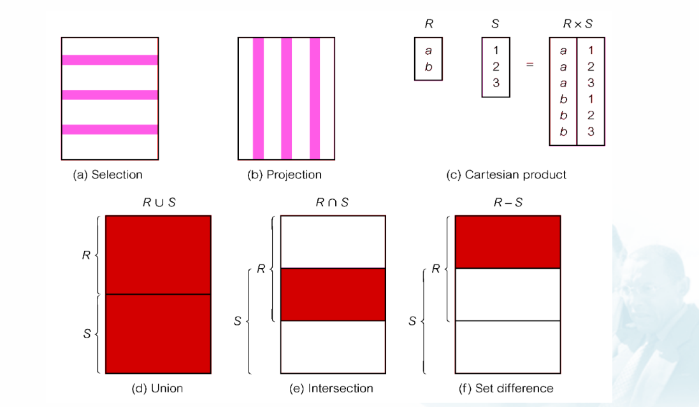
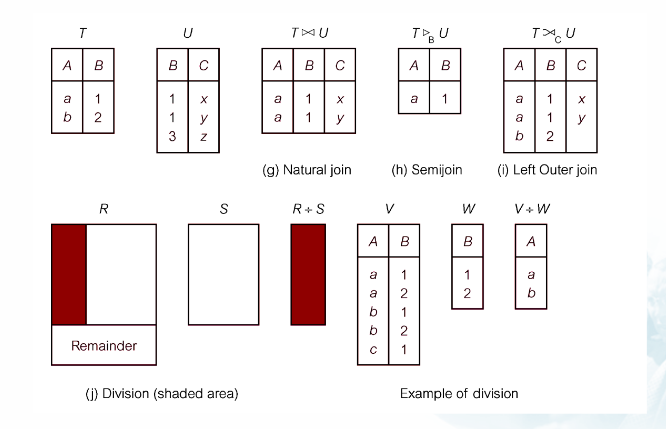

# Ba thành phần cuả mô hình dữ liệu quan hệ
- [Tổ chức dữ liệu]
- [Rằng buộc](./rang-buoc.md)
- Thao tác trên dữ liệu
- [Mô hình](./mo-hinh.md)
- [Khung nhìn dữ liệu ](./views.md) 
- Các phép toán trong đại số quan hệ 

